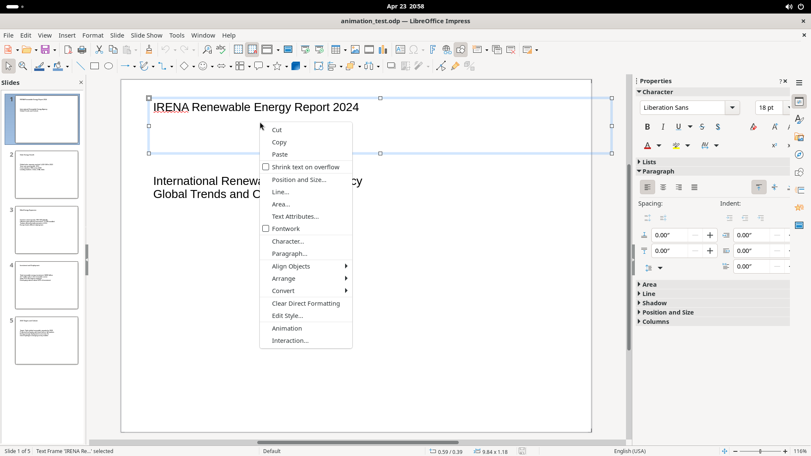
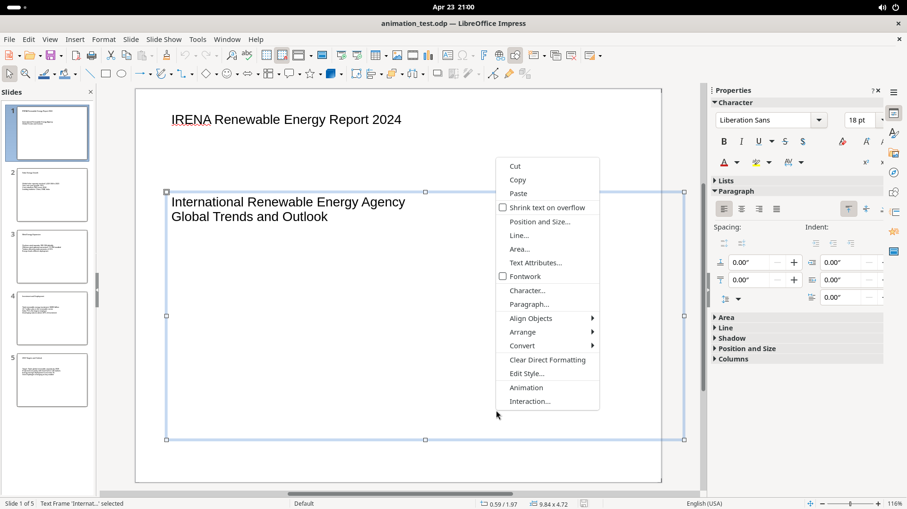

# Canvas & Status Bar

The main editing canvas in the center of the window and the status bar at the bottom.

## Screenshot

## Canvas

### Text frame interaction

- **Single left-click** on a text frame selects it (blue handles appear). The Properties panel switches to Character/Paragraph mode with font, size, bold/italic/underline, color, alignment, spacing controls.
- **Double-click** enters text editing mode inside the frame.

### Right-click context menu (on a text frame)

| Item | Notes |
|------|-------|
| Cut / Copy / Paste | Standard clipboard |
| Shrink text on overflow | Checkbox toggle |
| Position and Size | Opens dialog |
| Line / Area | Object styling dialogs |
| Text Attributes | Text frame settings |
| Fontwork | Checkbox toggle |
| Character / Paragraph | Opens formatting dialogs |
| Align Objects | Submenu |
| Arrange | Z-order submenu |
| Convert | Shape conversion submenu |
| Clear Direct Formatting | Reset to style |
| Edit Style | Edit the applied style |
| Animation | Set animation |
| Interaction | Set click-action |

## Status Bar

Elements from left to right:

| Element | Description |
|---------|-------------|
| Slide indicator | "Slide X of Y" (read-only) |
| Object name | Shows selected object type/name |
| Slide Master name | Click: open Master Slides dialog. Right-click: quick master list |
| Position readout | X/Y position of cursor or object (inches) |
| Size readout | Width x Height of selected object (inches) |
| Modification icon | Indicates unsaved changes |
| Text Language | Shows text language. Right-click to change |
| Fit slide button | Fit entire slide to window |
| Zoom Out / Slider / Zoom In | Adjust zoom level |
| Zoom factor | Shows percentage (e.g. "116%"). Click: Zoom dialog. Right-click: presets |
