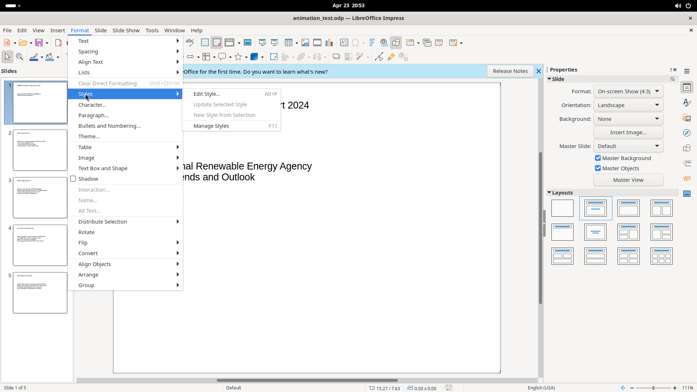
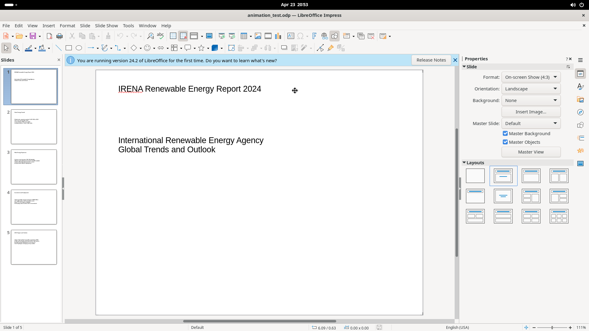
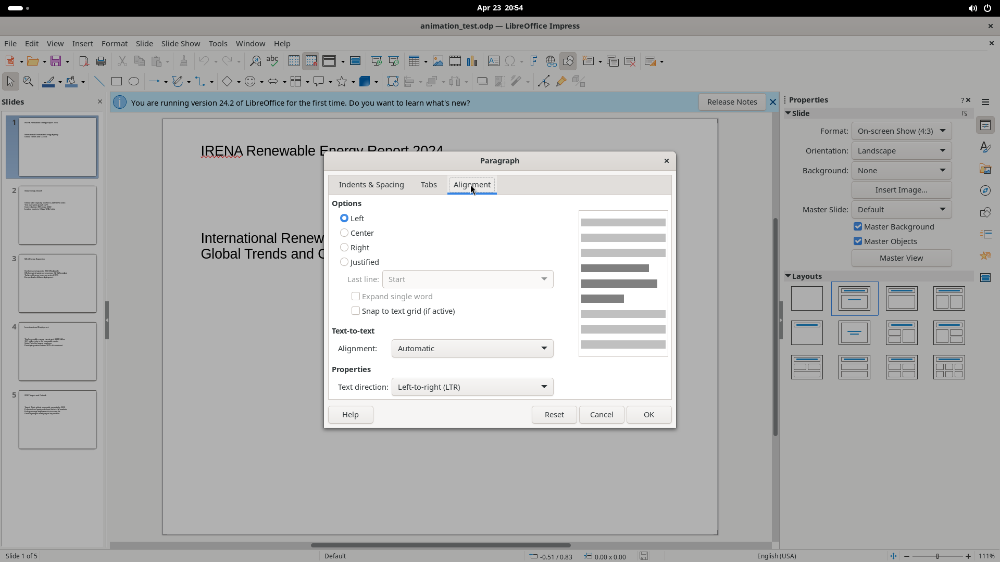

# Character & Paragraph Dialogs

Multi-tab dialogs for detailed text and paragraph formatting, opened via Format > Character, Format > Paragraph, and Format > Bullets and Numbering.

## Character Dialog (Format > Character)

### Fonts tab
- Family list + text field, Style dropdown, Size dropdown, Language dropdown, "Features..." button, preview pane

### Font Effects tab
- Font Color dropdown + Transparency spinner
- Overlining (style + color), Strikethrough (style), Underlining (style + color + "Individual words" checkbox)
- Case dropdown, Relief dropdown, Outline checkbox, Shadow checkbox
- Preview pane

### Position tab
- Position: Normal / Superscript / Subscript radio; Raise/lower by spinner; Relative font size spinner
- Scaling: Scale width spinner, "Fit to line" checkbox
- Spacing: Character spacing spinner, "Pair kerning" checkbox
- Preview pane

### Highlighting tab
- "None" button and "Color" button (opens color picker)

**Buttons:** Help, Reset, Cancel, OK

---

## Paragraph Dialog (Format > Paragraph)

### Indents & Spacing tab
- Indent: Before text, After text, First line spinners + Automatic checkbox
- Spacing: Above/Below paragraph spinners + "Do not add space between paragraphs of same style" checkbox
- Line Spacing dropdown (Single / 1.5 / Double / Proportional / At least / Leading / Fixed) + value spinner
- Paragraph preview diagram

### Tabs tab
- Position field, list of set tab stops
- Type radio: Left / Right / Centered / Decimal / Character
- Fill Character radio: None / ...... / -------- / ___ / Custom character
- New, Delete all, Delete buttons

### Alignment tab
- Options: Left / Center / Right / Justified radio
- Last line dropdown, "Expand single word" checkbox
- "Snap to text grid" checkbox
- Text-to-text Alignment dropdown, Text direction dropdown (LTR etc.)
- Paragraph preview diagram

**Buttons:** Help, Reset, Cancel, OK

---

## Bullets and Numbering Dialog (Format > Bullets and Numbering)

Single pane (no tabs):
- **Level column:** List 1–10 (plus "1–10" to set all at once)
- **Properties:** Type dropdown (Bullet/Number/etc.), Character Select button, Color dropdown
- **Size:** Relative size spinner (%)
- **Position:** Indent spinner, Width spinner, Relative checkbox, Alignment buttons (left/center/right)
- **Scope:** Slide / Selection radio, "Apply to Master" button
- **Preview pane** showing all 10 indent levels

**Buttons:** Help, Reset, Cancel, OK
