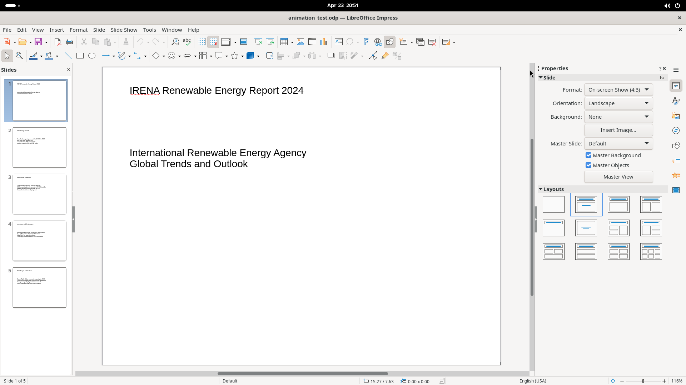

# Drawing Toolbar (Second Icon Row)

The drawing toolbar runs horizontally at y~104, providing selection, drawing, shape-insertion, color, rotation, alignment, and editing tools. Most shape buttons are split: click to draw with the current sub-type, or click the dropdown arrow to open a shape palette.

## Screenshot

## Elements (left to right)

**Selection & Zoom:** **Select** (arrow tool), **Zoom & Pan** (Ctrl to zoom out, Shift to pan)

**Colors (split buttons):** **Line Color** (current: Dark Blue 1, dropdown: color picker), **Fill Color** (current: Light Blue 2, dropdown: color picker)

**Drawing tools (split buttons with shape palettes):**
- **Insert Line** (straight line; double-click for multi-selection)
- **Rectangle** (hold Shift for square)
- **Ellipse** (hold Shift for circle)
- **Lines and Arrows** (dropdown: ~11 arrow/line variants)
- **Curves and Polygons** (dropdown: curve/polygon sub-types)
- **Connectors** (dropdown: straight/curved/elbow styles)

**Shape categories (split buttons with palettes):**
- **Basic Shapes** (triangles, pentagons, etc.)
- **Symbol Shapes** (smileys, hearts, etc.)
- **Block Arrows** (directional arrows)
- **Flowchart** (process, decision, terminator, etc.)
- **Callout Shapes** (speech bubbles)
- **Stars and Banners**
- **3D Objects** (cube, sphere, cylinder, etc.)

**Object operations:** **Rotate**, **Align Objects** (dropdown: left/center/right/top/middle/bottom), **Arrange** (dropdown: z-order), **Distribute** (requires 3+ objects)

**Effects & editing:** **Shadow** (toggle), **Crop Image**, **Filter** (dropdown: image filters), **Toggle Point Edit Mode** (F8), **Show Gluepoint Functions**, **Toggle Extrusion** (3D effect on 2D objects)
