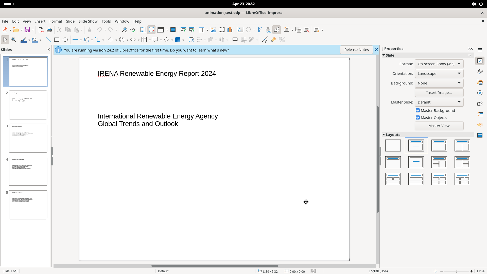

# Edit & View Menus

The Edit menu provides clipboard, selection, search, and object-editing commands. The View menu controls presentation modes, UI layout, toolbars, display overlays, panels, and zoom.

## Screenshot

## Edit Menu Elements

### Common actions (one-line)

Undo (Ctrl+Z), Redo (Ctrl+Y), Cut (Ctrl+X), Copy (Ctrl+C), Paste (Ctrl+V), Select All (Ctrl+A).

### Paste Special (submenu)

- **Paste Unformatted Text** (Shift+Ctrl+Alt+V)
- **Paste Special...** (Shift+Ctrl+V) — opens format-selection dialog

### Duplicate (Shift+F3)

Duplicates selected object(s) on the slide.

### Find (Ctrl+F)

Opens a docked Find toolbar at the bottom with: search field, Find All button, Match Case checkbox.

### Find and Replace (Ctrl+H)

Opens a modal dialog:

- Find/Replace text fields
- Match case, Whole words only checkboxes
- Find Previous, Find Next, Replace, Replace All buttons
- Other options: Current selection only, Replace backwards, Similarity search, Diacritic-sensitive

### Toggle Point Edit Mode (F8)

Enters/exits vertex-point editing for shapes.

### Gluepoints

Shows/hides glue points on objects for connector lines.

### Edit Mode (Shift+Ctrl+M)

Toggles between edit mode and read-only mode (checked by default).

---

## View Menu Elements

### View modes (radio group)

Normal (default), Outline, Notes, Slide Sorter, Master Slide, Master Notes, Master Handout.

### User Interface

Opens a dialog to choose UI layout: Standard Toolbar, Tabbed, Single Toolbar, Sidebar, Tabbed Compact, Groupedbar Compact, Contextual Single. Apply per-app or globally.

### Toolbars (submenu)

Checkbox list of all available toolbars. Default active: Drawing, Presentation, Standard. Includes **Customize...** at the bottom. Full list includes 3D-Objects, Comments, Edit Points, Find, Form Controls, Image, Insert, Line and Filling, Text Formatting, Transformations, Zoom, and many more.

### Show/Hide toggles

| Toggle | Default | Shortcut |
|--------|---------|----------|
| Status Bar | on | — |
| Slide Pane | on | — |
| Views Tab Bar | off | — |
| Rulers | off | Shift+Ctrl+R |
| Comments | on | — |
| Color Bar | off | — |

### Grid and Helplines (submenu)

Display Grid, Grid to Front, Helplines While Moving — all off by default.

### Snap Guides (submenu)

Display Snap Guides (off), Snap to Grid (on), Snap to Snap Guides (on), Snap to Object Border (on), Snap to Page Margins (on), others.

### Color/Grayscale (submenu)

Radio options: Color (default), Grayscale, Black and White.

### Panels & Sidebars

Sidebar (Ctrl+F5), Slide Layout, Slide Transition, Animation, Styles (F11), Gallery, Navigator (Shift+Ctrl+F5).

### Zoom (submenu)

Entire Page, Page Width, Optimal View, 50%/75%/100%/150%/200%, Zoom & Pan, Zoom Previous/Next, Object Zoom, Zoom... (custom dialog).
