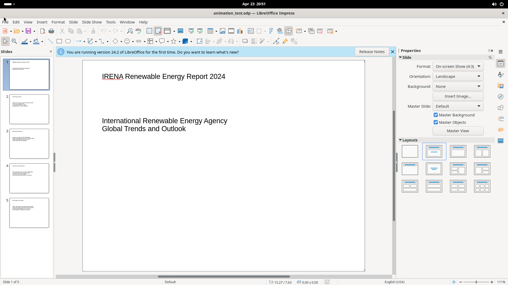
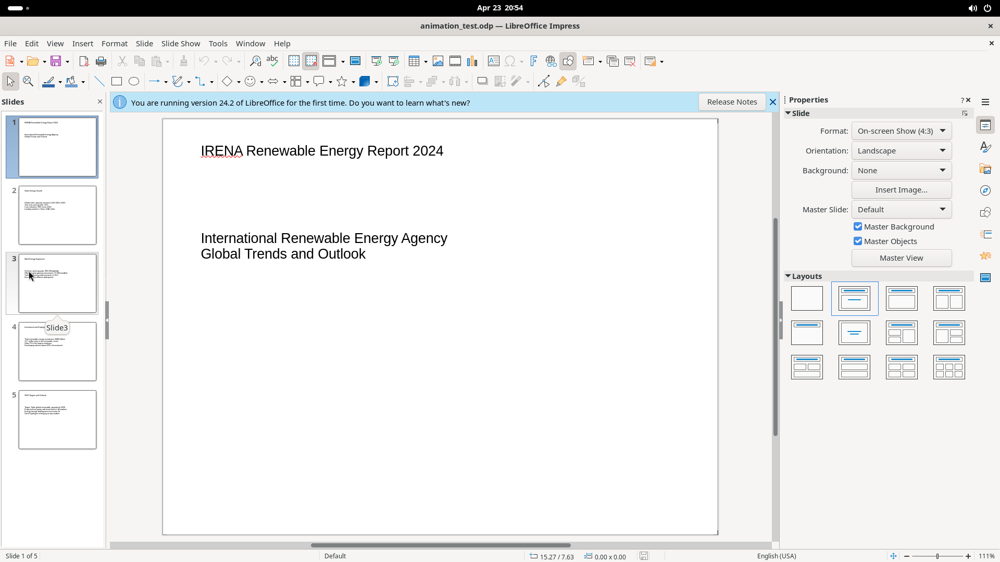
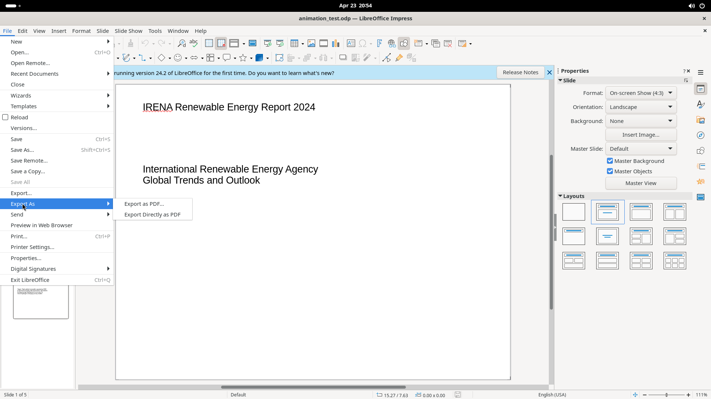

# File Menu

The File menu provides all document-level operations: creating, opening, saving, exporting, printing, and managing document properties, versions, and templates.

## Screenshot

## Elements

### Common actions (one-line)

New (Ctrl+N), Open (Ctrl+O), Save (Ctrl+S), Save As (Shift+Ctrl+S), Close, Save All, Save a Copy, Save Remote, Open Remote, Reload, Exit LibreOffice (Ctrl+Q).

### New (submenu)

Creates a new document. Submenu types: Presentation (Ctrl+N), Text Document, Spreadsheet, Drawing, Formula, Database, HTML Document, XML Form Document, Labels, Business Cards, Master Document, Templates (Shift+Ctrl+N).

### Recent Documents (submenu)

Lists recently opened files with a **Clear List** option at the bottom.

### Wizards (submenu)

Guided creation wizards: Letter, Fax, Agenda, Document Converter, Address Data Source.

### Templates (submenu)

- Edit Template
- Save as Template
- Manage Templates (Shift+Ctrl+N)

### Versions

Opens the Versions dialog — save new versions, compare, and manage version history.

### Export (File > Export...)

Opens a file-picker with format dropdown (default: WebP). Supports export to various image/web formats.

### Export As (submenu)

- **Export as PDF...** — opens the full [PDF Options dialog](pdf-options-dialog.md) (6 tabs)
- **Export Directly as PDF** — one-click PDF export without dialog

### Send (submenu)

- Email Document
- Email as PDF

### Print (Ctrl+P)

Opens the Print dialog with two tabs:

- **General** — Printer selection, range/copies, page layout (paper size, orientation, pages per sheet)
- **LibreOffice Impress** — Document type (Slides/Handouts), contents (slide name, date/time, hidden pages), color mode, sizing options
- Left preview panel with page navigation

### Properties

Opens a 5-tab dialog for document metadata:

| Tab | Key controls |
|-----|-------------|
| General | File info, editing time, revision, Change Password, Digital Signatures |
| Description | Title, Subject, Keywords, Comments, and Dublin Core fields |
| Custom Properties | Name/Type/Value table with Add Property button |
| Security | Read-only, Record changes, Protect |
| Font | Font embedding options and script selection |

### Digital Signatures (submenu)

- Digital Signatures — manage document signatures
- Sign Existing PDF

### Save As dialog

File picker with Encrypt with GPG key, Edit filter settings, Save with password checkboxes. Default format: ODF Presentation (.odp).

### Preview in Web Browser

Opens a browser preview of the presentation.
