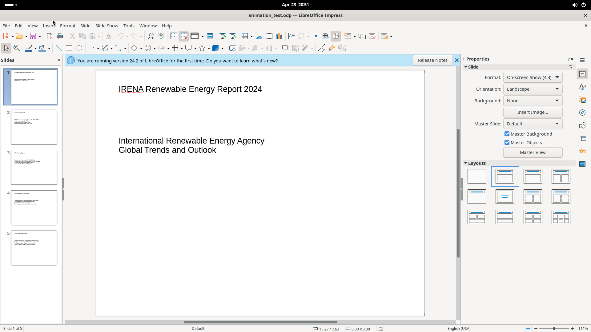

# Format Menu

The Format menu provides text formatting, object manipulation, and slide-layout controls. It contains 24 top-level items, many with submenus, and opens several multi-tab dialogs for detailed formatting.

## Screenshot

## Elements

### Text (submenu)

Inline text toggles and case commands:
- **Bold** (Ctrl+B), **Italic** (Ctrl+I), Single Underline, Double Underline, Strikethrough, Overline, Superscript (Shift+Ctrl+P), Subscript (Shift+Ctrl+B), Shadow, Outline Font Effect
- **Increase Size** (Ctrl+]), **Decrease Size** (Ctrl+[)
- Case changes: UPPERCASE, lowercase, Cycle Case, Sentence case, Capitalize Every Word, tOGGLE cASE, Small capitals

### Spacing (submenu)

Line Spacing: 1 (Ctrl+1), 1.5 (Ctrl+5), 2 (Ctrl+2). Increase/Decrease Paragraph Spacing. Increase/Decrease Indent.

### Align Text (submenu)

Horizontal: Left (Ctrl+L), Center (Ctrl+E), Right (Ctrl+R), Justified (Ctrl+J). Vertical: Top, Center, Bottom.

### Lists (submenu)

Unordered List, Ordered List, Demote (Shift+Alt+Right), Promote (Shift+Alt+Left), Move Down/Up.

### Clear Direct Formatting (Shift+Ctrl+M)

Removes all manually applied formatting, reverting to style defaults.

### Styles (submenu)

Edit Style (Alt+P), Update Selected Style, New Style from Selection, Manage Styles (F11).

### Character / Paragraph / Bullets and Numbering

These open complex multi-tab dialogs. See [Character & Paragraph Dialogs](character-paragraph-dialogs.md) for full details.

### Theme

Opens a color-theme picker: LibreOffice (light/dark), Rainbow, Beach, Sunset, Ocean, Forest, Breeze. Add button for custom themes.

### Table (submenu)

Row/column/cell operations (active only when a table is selected): Minimal/Optimal Row Height, Distribute Rows Evenly, Select/Insert/Delete Rows, Minimal/Optimal Column Width, Distribute Columns Evenly, Select/Insert/Delete Columns, Merge Cells, Split Cells, Select, Properties.

### Image (submenu)

Crop, Original Size, Edit with External Tool, Replace, Compress, Save, Filter (submenu), Color, Crop Dialog, Graphic Size Check. Most require an image selection.

### Text Box and Shape (submenu)

Position and Size (F4), Text Attributes, Line, Area.

### Object operations

| Item | Behaviour |
|------|-----------|
| Shadow | Toggle drop shadow on selected object |
| Interaction | Set click-action for selected object |
| Name | Assign a name to selected object |
| Alt Text | Set accessibility text for selected object |
| Rotate | Activate rotation handles |

### Distribute Selection (submenu)

Distributes 3+ selected objects evenly: Horizontally (Left/Center/Spacing/Right), Vertically (Top/Center/Spacing/Bottom).

### Flip (submenu)

Vertically, Horizontally.

### Convert (submenu)

To Curve, To Polygon, To Contour, To 3D, To 3D Rotation Object, To Bitmap, To Metafile.

### Align Objects (submenu)

Left, Centered, Right, Top, Center, Bottom.

### Arrange (submenu)

Bring to Front (Shift+Ctrl++), Bring Forward (Ctrl++), Send Backward (Ctrl+-), Send to Back (Shift+Ctrl+-), In Front of Object, Behind Object, Reverse.

### Group (submenu)

Group (Shift+Ctrl+G), Ungroup (Shift+Ctrl+Alt+G), Enter Group (F3), Exit Group (Ctrl+F3).
