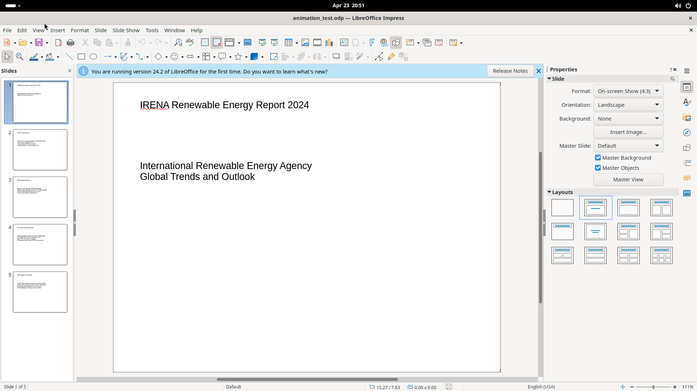
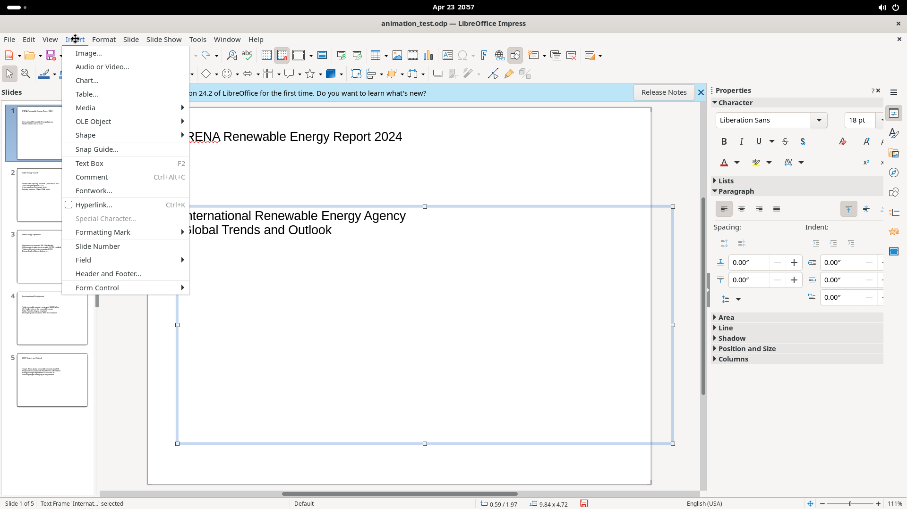

# Insert Menu

The Insert menu adds content objects to slides: images, media, charts, tables, shapes, text boxes, comments, hyperlinks, special characters, fields, headers/footers, and form controls.

## Screenshot

## Elements

### Image

Opens a file-browser dialog with Preview and Link checkboxes. Filter: all image formats.

### Audio or Video

Opens a file-browser dialog. Link checkbox is checked by default. Filter: all audio/video files.

### Chart

Immediately inserts a default column chart in in-place editing mode (no dialog). The Properties panel shows Chart Type settings (Column/Bar/Line etc.), 3D Look, Legend, Axes, Gridlines. Click outside to exit the chart editor.

### Table

Opens the Insert Table dialog: Number of columns (default 5), Number of rows (default 2).

### Media (submenu)

- **Gallery** — opens the Gallery panel
- **Photo Album** — opens a photo album dialog
- **Scan** — submenu: Select Source, Request (TWAIN/WIA scanner)
- **Animated Image** — inserts an animated GIF/image

### OLE Object (submenu)

- **Formula Object** (Shift+Alt+E) — inserts a Math formula in-place
- **QR and Barcode** — dialog with URL/Text field, error correction level, margin, type (QR Code / barcode)
- **OLE Object** — dialog: Create new (Spreadsheet, Drawing, Formula, Chart, Text, etc.) or Create from file

### Shape (submenu)

Categories: Line, Basic Shapes, Symbol Shapes, Block Arrows, Flowchart, Callout Shapes, Stars and Banners — each opens a shape-picker palette.

### Snap Guide

Opens a dialog: Position X/Y spinners, Type (Point / Vertical / Horizontal).

### Text Box (F2)

Activates text-box drawing mode (crosshair cursor). Draw to create a text frame.

### Comment (Ctrl+Alt+C)

Inserts a sticky-note comment directly on the slide.

### Fontwork

Opens the Fontwork Gallery — a grid of 30+ decorative text style thumbnails. Select and click OK to insert.

### Hyperlink (Ctrl+K)

Opens a multi-panel Hyperlink dialog:

| Panel | Key controls |
|-------|-------------|
| Internet | URL field, Text field, Frame/Form settings |
| Mail | Recipient, Subject, address-book button |
| Document | Path field, Target in Document picker |
| New Document | Edit now/later radio, File field, File type list |

### Special Character

Opens a character-picker dialog (requires active text cursor): Search field, Font/Character block dropdowns, character grid, Hex/Decimal fields, Recent and Favorite characters.

### Formatting Mark (submenu)

No-break Space (Shift+Ctrl+Space), Non-breaking Hyphen, Soft Hyphen, Narrow No-break Space, Zero-width Space (Ctrl+/), Word Joiner.

### Slide Number / Field (submenu)

Direct-insert fields: Date (fixed/variable), Time (fixed/variable), Author, Slide Number, Slide Title, Slide Count, File Name.

### Header and Footer

Dialog with two tabs:
- **Slides** — Date/time (fixed/variable), Footer text, Slide number, "Do not show on first slide"
- **Notes and Handouts** — Header text, Date/time, Footer text, Page number

### Form Control (submenu)

19 form control types: Label, Text Box, Check Box, Option Button, List Box, Combo Box, Push Button, Image Button, Formatted/Date/Time/Numerical/Currency/Pattern Fields, Group Box, Image Control, File Selection, Table Control, Navigation Bar.
