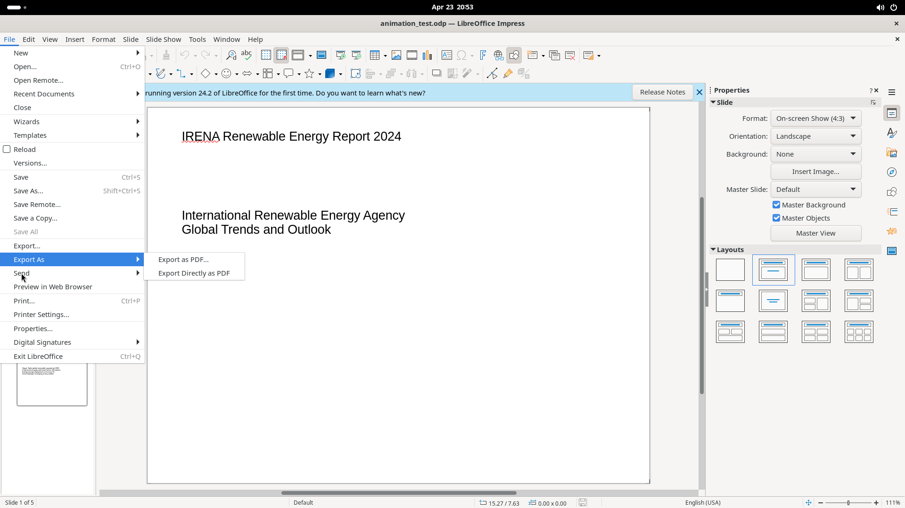

# PDF Options Dialog

A 6-tab dialog opened via File > Export As > Export as PDF. Controls all aspects of PDF output.

## Screenshot

## Tabs

### 1. General

- **Range:** All / Slides / Selection radio; "View PDF after export" checkbox
- **Images:** Lossless / JPEG compression with quality slider; Reduce image resolution dropdown
- **Watermark:** Sign with watermark option
- **General options:** Hybrid PDF (embed ODF), Archival PDF/A (version dropdown), Universal Accessibility, Tagged PDF, Create PDF form (submit format dropdown, allow duplicate field names)
- **Structure:** Export outlines, Comments as PDF annotations, Comments in margin, Export notes pages, Export only notes pages, Export hidden pages, Export automatically inserted blank pages, Use reference XObjects

### 2. Initial View

- **Panes:** Page only / Outline and page / Thumbnails and page; Open on page spinner
- **Page Layout:** Default / Single page / Continuous / Continuous facing
- **Magnification:** Default / Fit in window / Fit width / Fit visible / Zoom factor spinner

### 3. User Interface

- **Window Options:** Resize window to initial page, Center window, Open in full screen, Display document title
- **User Interface Options:** Hide menubar, Hide toolbar, Hide window controls
- **Transitions:** Use transition effects
- **Collapse Outlines:** Show All / Visible levels spinner

### 4. Links

- **General:** Export bookmarks as named destinations, Convert document references to PDF targets, Export URLs relative to file system
- **Cross-document Links:** Default mode / Open with PDF reader / Open with Internet browser

### 5. Security

- **Encryption:** Set Passwords button, password status
- **Printing:** Not permitted / Low resolution / High resolution
- **Changes:** Not permitted / Inserting+deleting+rotating / Filling in form fields / Commenting+filling / Any except extracting
- **Content:** Enable copying of content, Enable text access for accessibility tools

### 6. Digital Signatures

- **Certificate:** Select/Clear buttons, certificate field, Certificate password
- **Details:** Location, Contact information, Reason
- **Time Stamp Authority** dropdown

**Dialog buttons:** Help, Cancel, Export
