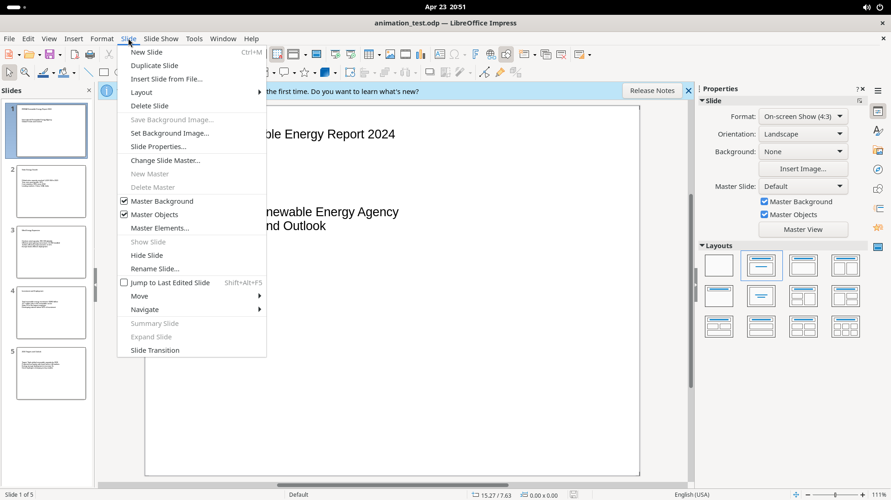
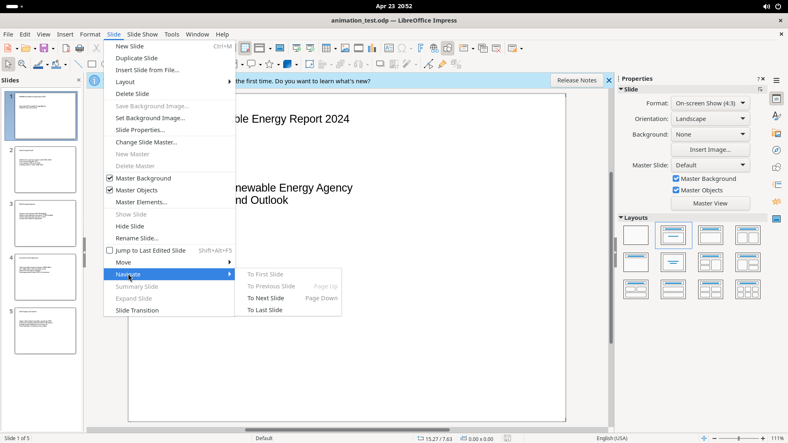
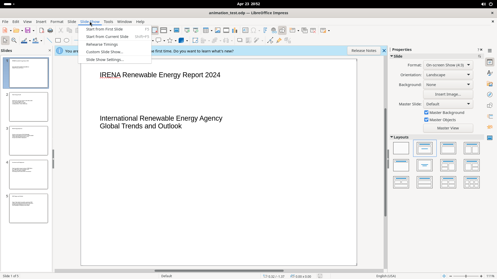

# Slide, Slide Show, Tools, Window & Help Menus

Five smaller menus covering slide management, presentation playback, application tools, window management, and help resources.

## Screenshot

## Slide Menu

### Slide operations

| Item | Shortcut | Notes |
|------|----------|-------|
| New Slide | Ctrl+M | Inserts a new slide |
| Duplicate Slide | — | Copies current slide |
| Insert Slide from File | — | Opens file picker |
| Delete Slide | — | Removes current slide |
| Set Background Image | — | Sets bg image from file |
| Slide Properties | — | Opens properties dialog |
| Change Slide Master | — | Opens master picker |
| Hide Slide / Show Slide | — | Toggle slide visibility |
| Rename Slide | — | Opens rename dialog |
| Summary Slide | — | Inserts summary |
| Slide Transition | — | Opens transition panel |

### Layout (submenu)

16 layout options: Blank Slide, Title Only, Title Slide, Title+Content, Centered Text, Title+2 Content, and 10 more multi-content variations including vertical layouts.

### Move (submenu)

Slide to Start (Shift+Alt+Home), Slide Up (Shift+Alt+PgUp), Slide Down (Shift+Alt+PgDn), Slide to End (Shift+Alt+End).

### Navigate (submenu)

To First Slide, To Previous Slide (PgUp), To Next Slide (PgDn), To Last Slide.

### Master Slide controls

Master Background (checkbox, default on), Master Objects (checkbox, default on), Master Elements.

---

## Slide Show Menu

| Item | Shortcut | Notes |
|------|----------|-------|
| Start from First Slide | F5 | Full-screen from slide 1 |
| Start from Current Slide | Shift+F5 | From current slide |
| Rehearse Timings | — | Record slide timing |
| Custom Slide Show | — | Create/manage custom shows |
| Slide Show Settings | — | Configure show options |

---

## Tools Menu

### Spelling & Language

- Spelling (F7), Automatic Spell Checking (Shift+F7, on by default), Thesaurus (Ctrl+F7)
- Language submenu: For All Text (set language), Hyphenation, More Dictionaries Online

### Productivity tools

AutoCorrect Options, Redact, Auto-Redact, Minimize Presentation, ImageMap, Color Replacer, Media Player.

### Forms (submenu)

Design Mode (on), Control Wizards (on), Control/Form Properties, Form Navigator, Activation Order, Add Field, Open in Design Mode, Automatic Control Focus.

### Macros (submenu)

Run Macro, Edit Macros, Organize Macros, Digital Signature, Organize Dialogs.

### Configuration

- Development Tools
- XML Filter Settings
- Extensions (Ctrl+Alt+E)
- Customize (toolbar/menu customization)
- Options (Alt+F12) — application-wide settings

---

## Window Menu

New Window, Close Window (Ctrl+W), list of open documents.

---

## Help Menu

Common actions: LibreOffice Help (F1), Search Commands (Shift+Escape).

Other items: What's This?, User Guides, Show Tip of the Day, Get Help Online, Send Feedback, Restart in Safe Mode, Get Involved, Donate, License Information, About LibreOffice.
