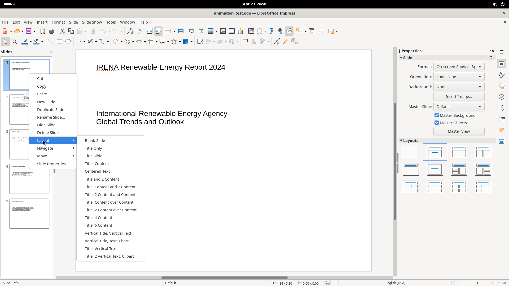

# Slides Panel

The Slides panel on the left side of the window displays numbered slide thumbnails. It supports click-to-navigate, drag-to-reorder, and a rich right-click context menu.

## Screenshot

## Elements

### Panel header

- **"Slides" label** — panel title
- **Close Pane (x)** button — collapses the panel. Reopen via View > Slide Pane.

### Slide thumbnails

- Numbered 1–N, stacked vertically
- **Left-click** navigates to that slide in the canvas
- **Drag** to reorder slides
- Active slide has a highlighted border

### Right-click context menu

| Item | Notes |
|------|-------|
| Cut / Copy / Paste | Clipboard for slides |
| New Slide | Insert blank slide after selection |
| Duplicate Slide | Copy of current slide |
| Rename Slide | Opens rename dialog |
| Hide Slide | Toggle visibility in presentation |
| Delete Slide | Remove slide |
| Layout | Submenu: 16 layout options |
| Navigate | To Next Slide, To Last Slide |
| Move | Slide Up/Down, To Start/End |
| Slide Properties | Opens properties dialog |
