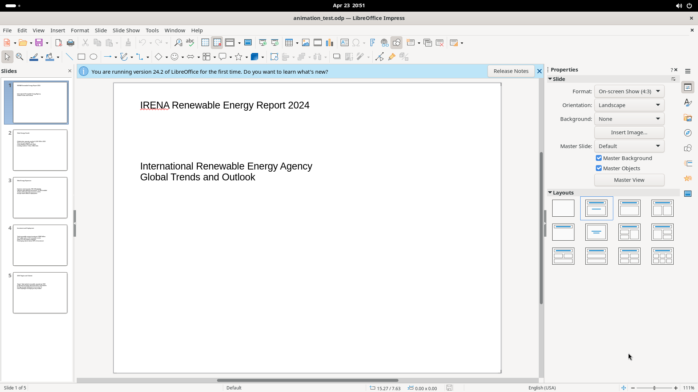

# Standard Toolbar (First Icon Row)

The standard toolbar runs horizontally across the top of the window (y~77). It contains ~33 icon buttons covering file operations, clipboard, undo/redo, search, view, presentation, and insert tools. Many buttons have dropdown arrows for additional options.

## Screenshot

## Elements (left to right)

**File operations:** **New** (Ctrl+N, dropdown: document types), **Open** (Ctrl+O, dropdown: recent files), **Save** (Ctrl+S, dropdown: save variants), **Export Directly as PDF**, **Print** (Ctrl+P)

**Clipboard:** **Cut** (Ctrl+X), **Copy** (Ctrl+C), **Paste** (Ctrl+V, dropdown: paste special), **Clone Formatting** (double-click to lock for multi-selection)

**History:** **Undo** (Ctrl+Z, dropdown: undo history), **Redo** (Ctrl+Y, dropdown: redo history)

**Find & Spelling:** **Find and Replace** (Ctrl+H), **Spelling** (F7)

**Canvas controls:** **Display Grid** (toggle), **Snap to Grid** (toggle), **Display Views** (dropdown: Normal/Outline/Slide Sorter/Notes), **Master Slide** (switch to master edit)

**Presentation:** **Start from First Slide** (F5), **Start from Current Slide** (Shift+F5)

**Insert tools:** **Table** (dropdown: row/column grid picker), **Insert Image**, **Insert Audio or Video**, **Insert Chart**, **Insert Text Box** (F2, double-click for multi), **Insert Special Characters**, **Insert Fontwork Text**, **Insert Hyperlink** (Ctrl+K)

**Drawing & Slides:** **Show Draw Functions** (toggle drawing toolbar), **New Slide** (Ctrl+M, dropdown: layout picker), **Duplicate Slide**, **Delete Slide**, **Slide Layout** (dropdown: layout thumbnails)
