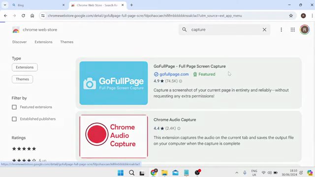
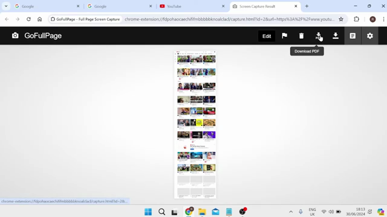
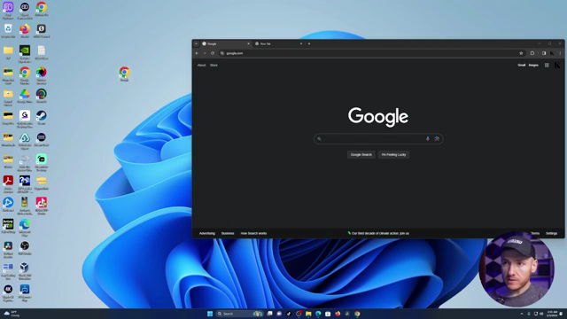

# Downloads & Shortcuts

## Save a Webpage as PDF (Using GoFullPage Extension)

### Steps
1. Open Chrome and navigate to the **Chrome Web Store** (`https://chromewebstore.google.com`).
2. Search for **"GoFullPage"** (or "Full Page Screen Capture").
3. Click on **GoFullPage - Full Page Screen Capture** in the results.

4. Click **Add to Chrome**, then **Add extension**.
5. Navigate to the webpage you want to save as PDF.
6. Click the **GoFullPage** extension icon (camera icon) in the toolbar.
7. The extension captures the entire page and displays a preview.
8. Click the **Download PDF** button in the top-right area of the capture preview.

9. Accept any permission dialogs. The PDF downloads to your default downloads folder.

### Verification
Open the downloaded PDF file — it contains the full webpage content rendered as a PDF document.

---

## Create a Desktop Shortcut for a Website

### Steps
1. Open Chrome and navigate to the desired website.
2. Resize the Chrome window so the desktop is visible behind it (click the Restore Down button or drag the window edges).
3. In the address bar, locate the small **site icon** (favicon) to the left of the URL.
4. Click and drag the site icon from the address bar onto the desktop.

5. Release the mouse button to drop the shortcut.

### Verification
A new shortcut icon appears on the desktop. Double-clicking it opens Chrome and navigates to the website.
