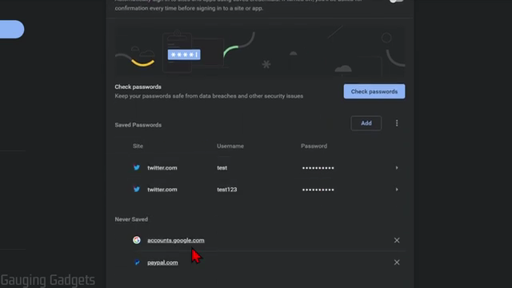
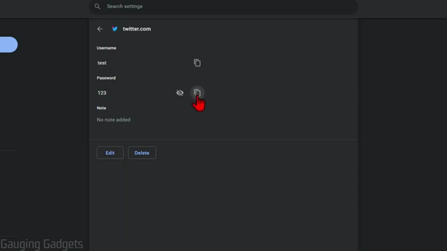

# Passwords

## View Saved Passwords

### Steps
1. Open Chrome and click the three-dot menu (top-right corner).
2. Click **Settings**.
3. In the left sidebar, click **Autofill and passwords** (or **Autofill** in older versions).
4. Click **Password Manager** (or navigate to `chrome://settings/passwords`).
5. Under **Saved Passwords**, a list of sites with stored credentials is displayed.

6. Click on any entry to view its details.
7. Click the **eye icon** (show password) next to the password field to reveal the password. You may be prompted to enter your computer's login password or use biometric authentication.
8. Click the **copy icon** next to the username or password to copy it to the clipboard.

### Verification
The password is displayed in plain text. The detail view also shows options to **Edit** or **Delete** the saved credential.
