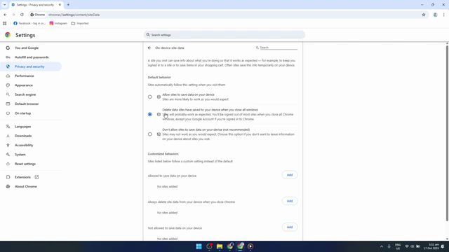
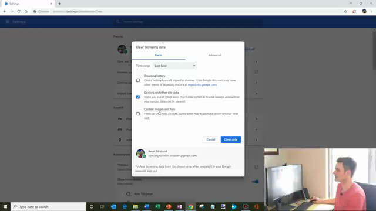
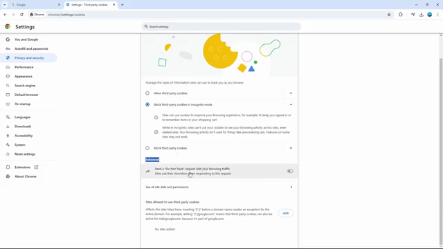
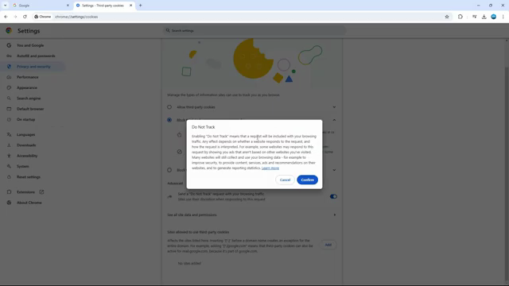
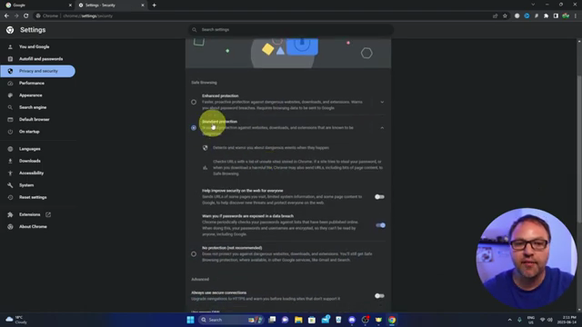
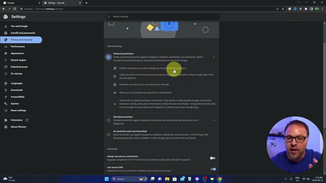

# Privacy & Security

## Auto-Delete Browsing Data When Closing Chrome

### Steps
1. Open Chrome and click the three-dot menu (top-right corner).
2. Click **Settings**.
3. In the left sidebar, click **Privacy and security**.
4. Click **Site settings**.
5. Scroll down and click **On-device site data** (near the bottom of the list).
6. Under **Default behavior**, select **Delete data sites have saved to your device when you close all windows**.

### Verification
The radio button for auto-delete is selected (blue). After closing all Chrome windows and reopening, cookies and site data from the previous session are cleared (you will be logged out of websites).

---

## Clear Specific Website Cookies

### Steps
1. Open Chrome and press **Ctrl+Shift+Delete** (keyboard shortcut), or click the three-dot menu > **More tools** > **Clear browsing data**.
2. The **Clear browsing data** dialog opens on the **Basic** tab.
3. Set the **Time range** dropdown (options: Last hour, Last 24 hours, Last 7 days, Last 4 weeks, All time).
4. Check or uncheck the desired categories:
   - **Browsing history**
   - **Cookies and other site data**
   - **Cached images and files**

5. Click **Clear data**.

### Verification
After clearing, previously stored cookies for the selected time range are removed. You may need to re-login to websites.

---

## Enable Do Not Track

### Steps
1. Open Chrome and click the three-dot menu (top-right corner).
2. Click **Settings**.
3. In the left sidebar, click **Privacy and security**.
4. Click **Third-party cookies** (or navigate to `chrome://settings/cookies`).
5. Scroll down to the **Advanced** section.
6. Toggle on **Send a "Do Not Track" request with your browsing traffic**.

7. A confirmation dialog appears explaining that websites may or may not honor the request. Click **Confirm**.

### Verification
The toggle is switched on (blue). Note: this sends a request header to websites but compliance is voluntary.

---

## Enable Safe Browsing (Enhanced Protection)

### Steps
1. Open Chrome and click the three-dot menu (top-right corner).
2. Click **Settings**.
3. In the left sidebar, click **Privacy and security**.
4. Click **Security**.
5. Under **Safe Browsing**, three options are displayed:
   - **Enhanced protection** — proactive protection, password breach warnings, sends URLs to Google for checking.
   - **Standard protection** — default level, warns about known dangerous sites.
   - **No protection (not recommended)** — disables Safe Browsing entirely.

6. Select **Enhanced protection**.

### Verification
The Enhanced protection radio button is selected (blue) and its feature list is expanded below it.
