# Settings & Preferences

## Change Chrome Interface Language

### Steps
1. Open Chrome and click the three-dot menu (top-right corner).
2. Click **Settings** (third option from the bottom of the menu).
3. In the left sidebar, click **Languages** (or scroll to the bottom of the Settings page and click **Advanced**, then find the **Languages** section).
4. Under the **Language** subsection, click **Add languages**.
5. In the dialog, search for and check the desired language (e.g., "English (United States)"), then click **Add**.

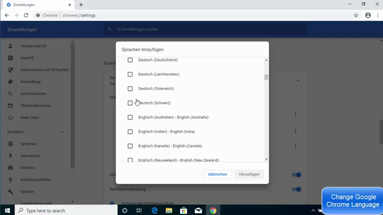

6. Back in the language list, click the three-dot menu next to the newly added language.
7. Select **Display Google Chrome in this language** (the first option in the menu).
8. A **Relaunch** button appears at the top of the language section. Click it to restart Chrome.

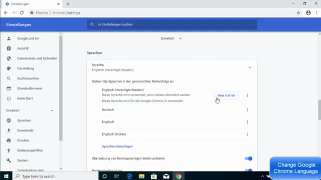

### Verification
After relaunch, the entire Chrome interface (menus, settings labels, sidebar) displays in the selected language.

---

## Change Chrome Profile Name

### Steps
1. Open Chrome and click the **profile icon** in the top-right corner (next to the three-dot menu).

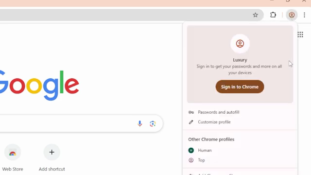

2. In the profile dropdown, click **Customize profile**.
3. The **Customize profile** page opens at `chrome://settings/manageProfile`.

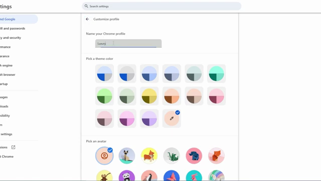

4. In the **Name your Chrome profile** text field, clear the existing name and type the new name.
5. The change saves automatically — no confirmation button is needed.

### Verification
The profile icon area and profile dropdown now display the updated name.

---

## Change Default Font Size

### Steps
1. Open Chrome and click the three-dot menu (top-right corner).
2. Click **Settings**.
3. In the left sidebar, click **Appearance** (or navigate to `chrome://settings/appearance`).
4. Locate the **Font size** dropdown (default is "Medium (Recommended)").

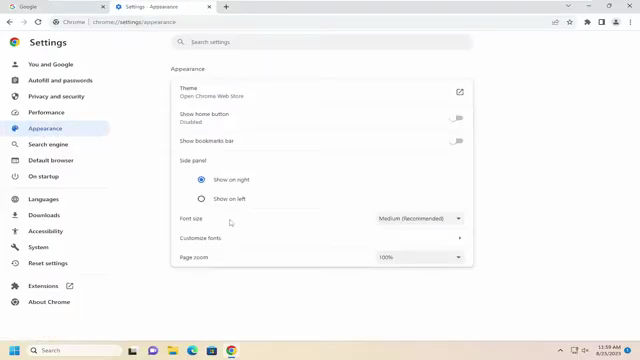

5. Click the dropdown and select the desired size: Very small, Small, Medium (Recommended), Large, or Very large.

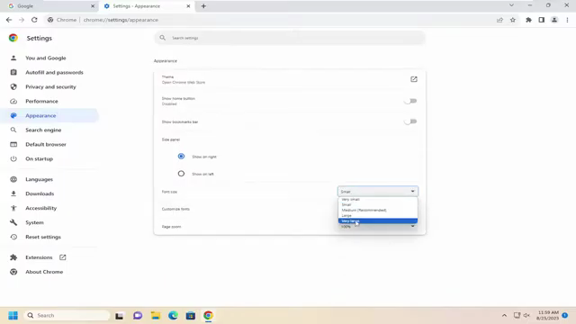

### Verification
Open any webpage — text renders at the newly selected font size.

---

## Change Number of Google Search Results Per Page

### Steps
1. Perform any Google search in Chrome.
2. Click the address bar to edit the URL.
3. Press the **End** key (Windows) or **Fn + Right Arrow** (Mac) to jump to the end of the URL.
4. Append `&num=50` (or any number between 1 and 100) to the end of the URL.

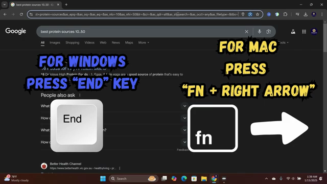

5. Press **Enter** to reload the page.

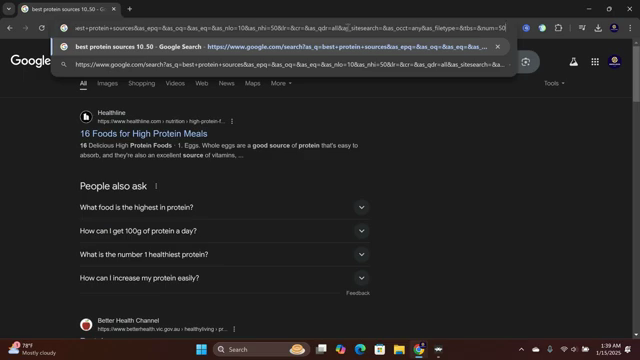

### Verification
The search results page now displays the specified number of results (e.g., 50) instead of the default 10. This parameter persists for subsequent pages of results.

---

## Make Bing the Default Search Engine

### Steps
1. Open Chrome and click the three-dot menu (top-right corner).

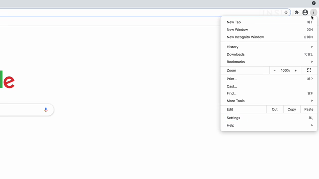

2. Click **Settings**.
3. In the left sidebar, click **Search engine** (or navigate to `chrome://settings/searchEngines`).
4. In the **Search engine used in the address bar** dropdown, select **Bing**.

### Verification
Type a search query in the address bar and press Enter. Results now appear on bing.com instead of google.com.

---

## Remove or Change Startup Page

### Steps
1. Open Chrome and click the three-dot menu (top-right corner).
2. Click **Settings**.
3. In the left sidebar, click **On startup** (or navigate to `chrome://settings/onStartup`).
4. Three options are available:
   - **Open the New Tab page** — Chrome opens a blank new tab.
   - **Continue where you left off** — Chrome reopens all tabs from the previous session.
   - **Open a specific page or set of pages** — Click **Add a new page**, enter the URL, and click **Add**. To remove an existing startup page, click the three-dot menu next to it and select **Remove**.

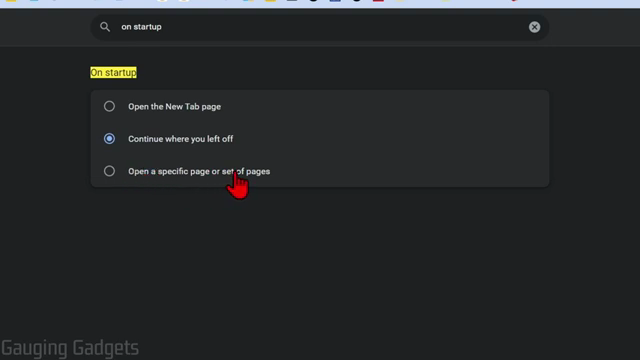

### Verification
Close and reopen Chrome. The browser starts with the configured page(s).

---

## Disable Dark Mode (via Extension)

### Steps
1. Open Chrome and navigate to the **Chrome Web Store** (search "chrome store" in Google or go to `https://chromewebstore.google.com`).
2. Search for **"Dark Mode"** in the Web Store search bar.
3. Select the **Dark Mode** extension (described as "A global dark theme for the web") from the results.

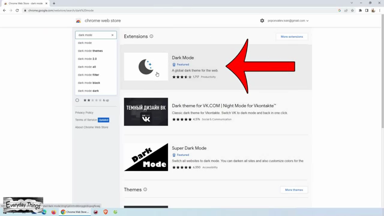

4. Click **Add to Chrome**, then click **Add extension** in the confirmation dialog.
5. Click the **Extensions** (puzzle piece) icon in the toolbar and click the **pin** icon next to Dark Mode to pin it to the toolbar.
6. Click the pinned **Dark Mode** icon to toggle dark mode on or off for any webpage.

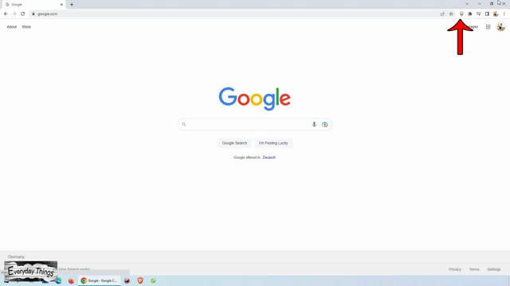

### Verification
Clicking the Dark Mode icon toggles the page theme between dark and light modes.

---

## Disable Chrome Refresh 2023 UI (Command Line Flag)

### Steps
1. Copy the command line flag: `--disable-features=CustomizeChromeSidePanel`

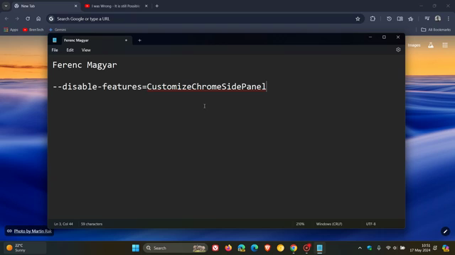

2. Close all Chrome windows completely.
3. Right-click any Chrome shortcut (desktop, Start menu, or taskbar) and select **Properties**.
4. In the **Shortcut** tab, locate the **Target** field.
5. Place the cursor after the closing quotation mark of the chrome.exe path, add a space, and paste the flag.
   - Example: `"C:\Program Files\Google\Chrome\Application\chrome.exe" --disable-features=CustomizeChromeSidePanel`

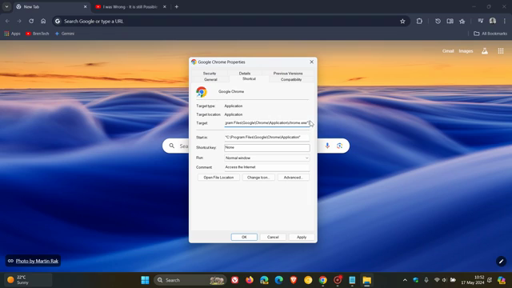

6. Click **Apply**, then **OK**.
7. Launch Chrome using this modified shortcut.

### Verification
Chrome opens with the older pre-Refresh 2023 UI style (classic toolbar buttons, side panel button reverted). To reverse, repeat the steps and delete the flag from the Target field.
